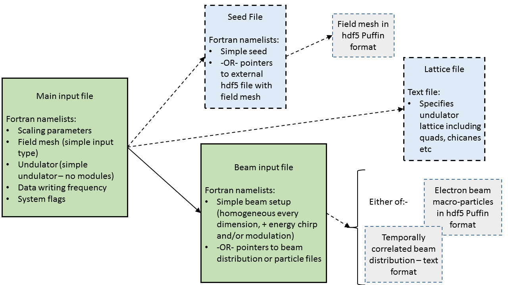

# How to Run

## Overview of input files

At a minimum, one must specify 2 files for use in Puffin - a main input file, and a beam input file. The main file sets up the system scaling, the field mesh, the integration step sizes, and other simulation options. A simple, single undulator system can be setup here. It also specifies the names of the other input files, including the beam file.

The beam file specifies the electron beam parameters - there are 3 different types of beam input, detailed later. Multiple beams can be specified, each with different characteristics, such as energies, lengths, charges, current profiles, etc.

Optionally, one may also supply a radiation seed file, to describe an injected radiation seed into the FEL with the electron beam. Similarly to the beam file, many radiation seeds can be specified here, at different frequencies, intensity profiles, etc.

In addition, one may also supply a lattice file, which describes the layout of undulator modules, focusing quadrupoles, chicanes, drifts etc. If this is not supplied, then a single undulator is set up as detailed in the main input file. If it is supplied, the wiggler in the main input file is ignored. Undulators can have independently variable polarizations, magnetic field strengths, etc. A description of available 3D undulator types is available in section.

The main input file sets the frequency of data dumps from Puffin. Additionally, a 'write file' can be supplied to give more flexibility and specify exactly when the data is written.

Puffin can be resumed from a previous run - if your cluster crashes, for instance. You could even resume from a previous run to extend or change undulator parameters, for instance.

Puffin comes with a few example input decks for reference.




## Running Puffin

Once installed, Puffin must be invoked with MPI, passing it the main input file, here called main.in:

```
mpirun -np 2 puffin main.in
```

which will launch Puffin on 2 MPI processes.

## Running the 'Puffin-user' container image

If using the 'user' Docker container image (see [here](BUILD.md)), then doing 
```
docker run -v $(pwd):/home/puffin_user/tmp/puffin-test mightylorenzo/puffin-user 2 clara.in
```
in a terminal will grab the image, and spin up a container, running Puffin on 2 processes, using the main input file `clara.in`. The input deck as described above should be in the current directory on the host - it will then be copied into the container, and when it is finished, the output files will be present in the current directory on the host.

## Viewing results
