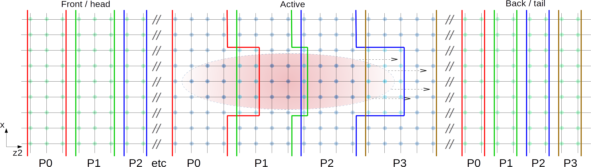

# Code Overview

Puffin represents the radiation field with a simple 3D mesh with equidistant sample nodes in each dimension, and the electron beam with a 6D distribution of macroparticles. The undulator fields are currently described analytically.

There are a number of different modes in Puffin which can be utilized to quickly test ideas without resorting to throwing a full 3D run on a cluster.

## Dimensionality

Puffin can be run in 1D or 3D mode. It is important to note that the approximations which Puffin is absent of in relation to other FEL codes are essentially '1D' approximations, meaning that in many cases fundamental deviations from 'usual' codes and theory can be shown in 1D.

## Temporal and Periodic Meshes

## Undulator Fields

