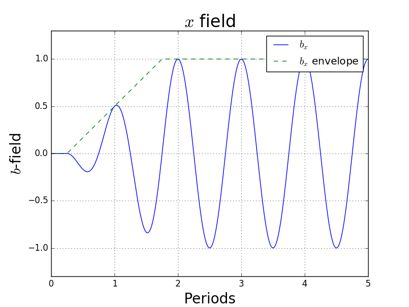
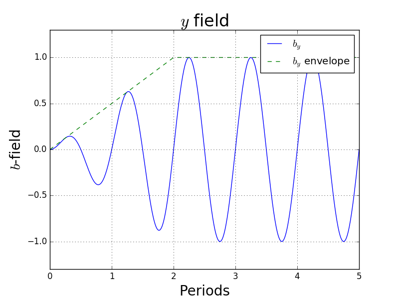



# 3D Magnetic Fields

## Main Undulator Models

The undulator is modelled analytically, and the model must include the fast wiggle motion. Puffin may be modified in the future to allow a map of the undulator field to be input. For now, there are a few generic undulator models employed. The undulator magnetic fields are chosen with the **zundType** string in the main input file.

Available options for use in Puffin are **'helical'**, **'planepole'** - corresponding to a planar wiggler with flat pole faces with natural focusing only in one direction, **'curved'** - corresponding to a planar undulator with curved, or canted, pole faces providing natural focusing in both transverse directions equally, and the default Puffin undulator, chosen with a blank string (**''**), where the transverse polarization is chosen with the **sux, suy** inputs, controlling the relative magnitudes of the peak magnetic fields in $$\bar{x}$$ and $$\bar{y}$$, respectively. These may vary between $$0$$ and $$1$$, allowing a general elliptic field to be described.

All of the undulator fields have an associated natural focusing channel, which arises from from the off-axis variation in the magnetic fields. This motion arises naturally when numerically solving the equations, and is not super-imposed artificially upon the electron motion.

## Full Magnetic Undulator Field Analytic Description

The analytic description of the undulator fields are based on those discussed in \cite{scharlemann1}, which in the scaled notation here are:-

**helical**
$$
b_x  = \cos({\bar{z}/2\rho}) \\
b_y =  \sin({\bar{z}/2\rho}) \\
b_z = \frac{\sqrt{\eta}}{2\rho} (-\bar{x}\sin({\bar{z} / (2 \rho)}) + \bar{y}\cos({\bar{z} / (2 \rho)}))
$$

**plane-pole**
$$
b_x = 0 \\
b_y =  \cosh((\sqrt{\eta}/{2\rho}) \bar{y}) \sin({\bar{z}/2\rho}) \\
b_z =   \sinh((\sqrt{\eta}/{2\rho}) \bar{y}) \cos({\bar{z} / (2 \rho)}
$$

**canted-pole**
$$
b_x =  \frac{\bar{k}_{\beta x}}{\bar{k}_{\beta y}}  \sinh(\bar{k}_{\beta x} \bar{x} )  \sinh(   \bar{k}_{\beta y} \bar{y}    )   \sin({\bar{z}/2\rho}) \\
b_y = \cosh(\bar{k}_{\beta x} \bar{x} )  \cosh(   \bar{k}_{\beta y} \bar{y}    )   \sin({\bar{z}/2\rho}) \\
b_z = \frac{\sqrt{\eta}}{2\rho \bar{k}_{\beta x}}     \cosh(\bar{k}_{\beta x} \bar{x} )    \sinh(   \bar{k}_{\beta y} \bar{y}    )    \cos({\bar{z}/2\rho})
$$

**variably polarized elliptical**
$$
b_x = u_x \cos({\bar{z}/2\rho}) \\
b_y =  u_y \sin({\bar{z}/2\rho}) \\
b_z = \frac{\sqrt{\eta}}{2\rho} (u_x \bar{x}\sin({\bar{z} / (2 \rho)}) + u_y \bar{y}\cos({\bar{z} / (2 \rho)}))
$$

In the $$1$$D approximation, $$b_z = 0$$.

All of the above have an associated *natural* focusing channel, which arises from from the off-axis variation in the magnetic fields. This motion arises naturally when numerically solving the equations, and is not super-imposed upon the electron motion.

## Undulator Ends

The undulators also include entry and exit tapers, and they may be switched on or off in the input file with the flag **qUndEnds**. Setting this to true will model a smooth tapering up and down of the undulator magnetic fields in the first and last 2 periods of the undulator. If they are switched off, the beam is artificially initialized with an expected initial condition in the transverse coordinates for that undulator. Including these ends will model a more realistic and natural entry and exit from the undulator, and will reduce CSE effects from the shape of the wiggler.

The $$x$$ field envelope increases more rapidly so that the first pole is at full strength. The $x$ field is symmetric, and the $$y$$ field is antisymmetric. The ends of the $$x$$ field shift the beam off-center by a small amount in the $$y$$ plane. The $$x$$ plane motion is not off-set by the $$y$$ field. Neither causes a velocity offset (or spatial drift) along the undulator. Note that the symmetry of the $x$ field technically results in an extra half-period of full-strength field oscillation in that direction.

## Natural Undulator Focusing

Each undulator type has an associated natural focusing wavenumber. In the helical case, the natural betatron wavenumber is

$$
\bar{k}_{\beta n x} = \bar{k}_{\beta n y} = \frac{a_w}{2 \sqrt{2} \rho \gamma_0},
$$

with $$\gamma_0$$ being the average energy of the electron beam (and not necessarily = $$\gamma_r$$, which only sets the scaling of the system.)

In the planar case,

$$
\bar{k}_{\beta n y} = 0, \\
\bar{k}_{\beta n y} = \frac{a_w}{2 \sqrt{2} \rho \gamma_0}.
$$

In the canted pole case,

$$
\bar{k}_{\beta n x,y} = \frac{a_w \bar{k}_{x,y}}{\sqrt{2 \eta} \gamma_0},
$$

where $\bar{k}_{x,y}$ describe the hyperbolic variation in the transverse directions, and must obey

$$
\bar{k}_x^2 + \bar{k}_y^2 = \frac{\eta}{4 \rho^2}
$$

to be physically valid. They determine the focusing strength in the $$\bar{x}$$ and $$\bar{y}$$ dimensions. Currently, we force $$\bar{k}_x = \bar{k}_y$$. For the case of equal focusing, then,

$$
\bar{k}_{\beta n x} = \bar{k}_{\beta n y} = \frac{a_w }{ 4 \rho \gamma_0}.
$$

## Strong Beam Focusing

In addition to the natural focusing channel, a constant, 'strong' focussing channel may be utilized, to focus the beam to a smaller transverse area. This is a magnetic field super-imposed upon the wiggler. It may be switched on or off with the flag **qFocussing** in the main input file, and is specified through the use of the variables **sKBetaXSF** and **sKBetaYSF**. It is probably highly artificial - it may be thought of as physically similar to an ion channel. Nevertheless it allows one to obtain strong focusing without using a lattice. It is defined very simply as

$$
b_x = \sqrt{\eta} \frac{\bar{k}_{\beta y}^2}{\kappa}\bar{y}_j, \\
b_y = - \sqrt{\eta} \frac{\bar{k}_{\beta x}^2}{\kappa}\bar{x}_j
$$

If either **sKBetaXSF** or **sKBetaYSF** are not specified, then no focusing channel will be added for that dimension, even if the **qFocussing** flag is true.

Magnetic quads between modules can be specified [in the lattice file](latticeelements.md).